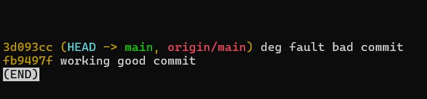
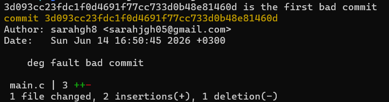

## Task 1 & Task 2

I looked for an issue on cli repo and found this [issue](https://github.com/httpie/cli/issues/1665) .
After reading the installation steps, I reproduced the issue in my enviroment and got a new error:


so i wrote a comment that contained my enviroment which is WSL with the latest version, and the outcome when i reproduced it following MCVE . [my comment](https://github.com/httpie/cli/issues/1665#issuecomment-4680427792)


## Task 3
I created a repo for simplicity and i created 2 commits, a good and a bad one:


I ran 
```
git bisect start
git bisect bad
git bisect good fb9497f
```

and the output was the bad commit:
