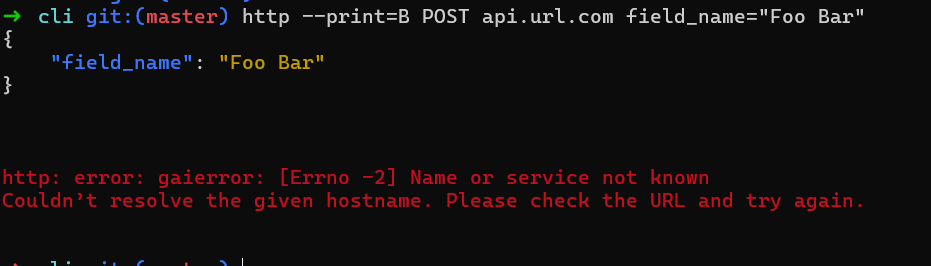

## Task 1

I looked for an issue on cli repo and found this [issue](https://github.com/httpie/cli/issues/1665) .
After reading the installation steps, I reproduced the issue in my enviroment and got a new error:

so i wrote a comment that contained my enviroment which is WSL with the latest version, and the outcome when i reproduced it. [my comment](https://github.com/httpie/cli/issues/1665#issuecomment-4680427792)