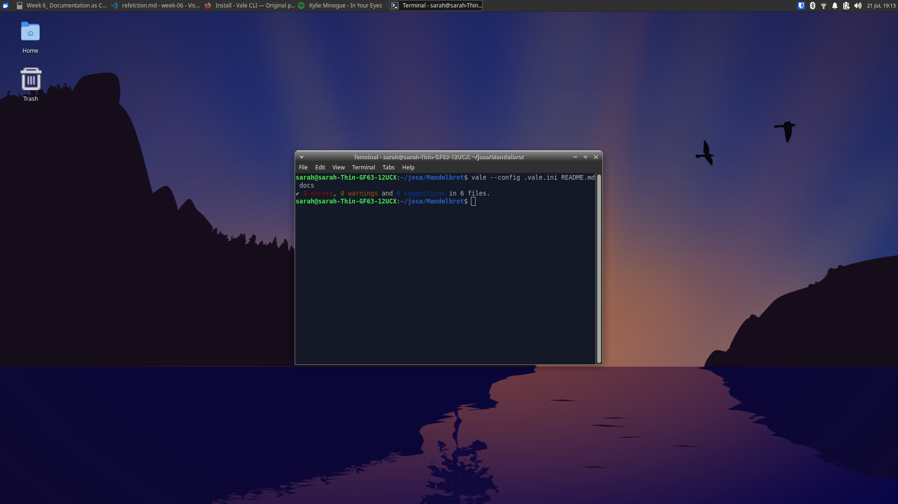

## Task 1
I contributed to tldr pages by adding arabic translation to some of the used documented commands. [pr](https://github.com/tldr-pages/tldr/pull/23213)

## Task 2
I installed mkdocs in my mandelbrot repo, i added the ref, tutoral and how to folders to guide users through out the installations and usage of the prject, i also enabled deployment using github actions in my repo settings, and tested the live deployment of the site after pushing the documentaion files, which was successful !

## Task 3
Adr is the Architectural Decision records used to justify the decisions of using a certain technical approach in a program i added in the docs folder in my mandelbrot viewer and wrote the reason behind some of the technical approaches.

## Task 4
Ms vale is used to check style guidelines in the documentaion, which is called linting, that ensures written content to adhere to a specific style, i added it to the project in the docs folder, by writing specific vocabs that are relevant to the project

i ran the vale locally on the repo and it passed all the tests